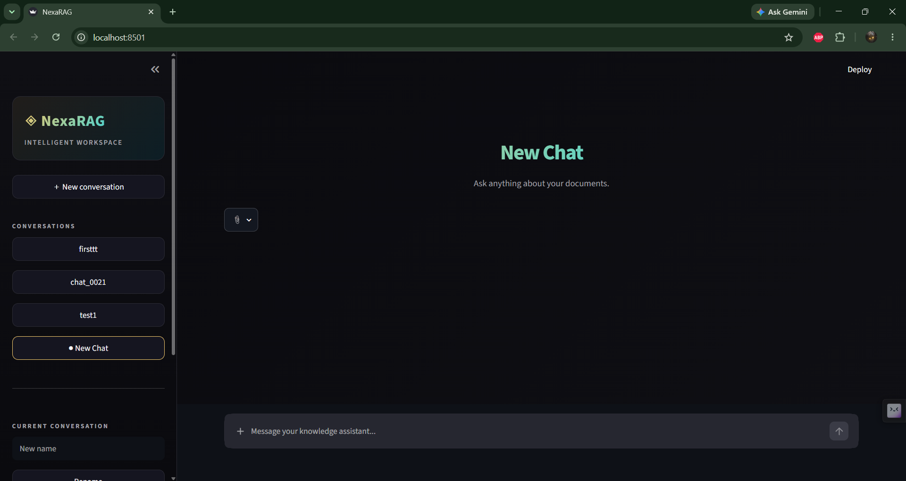
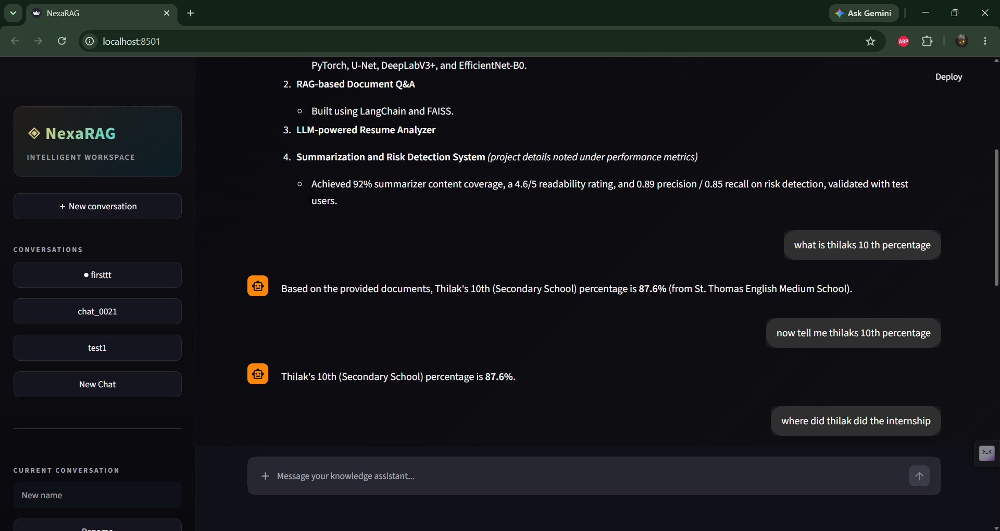
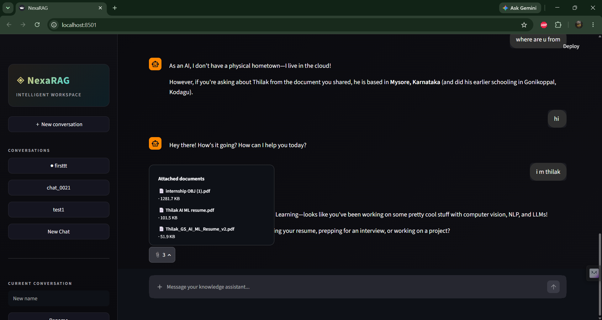
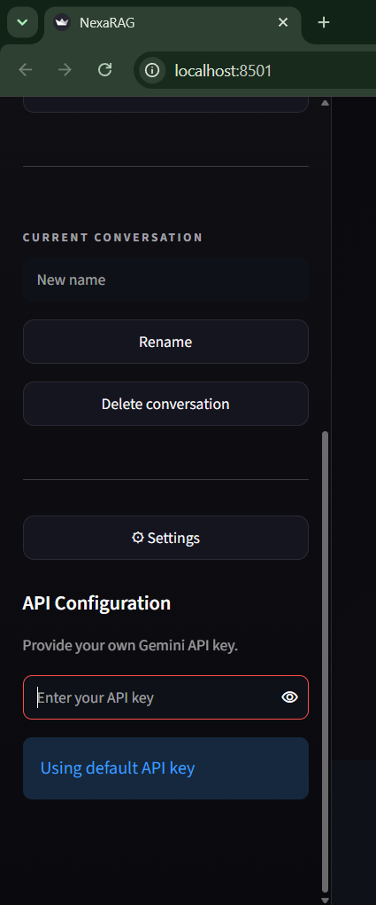
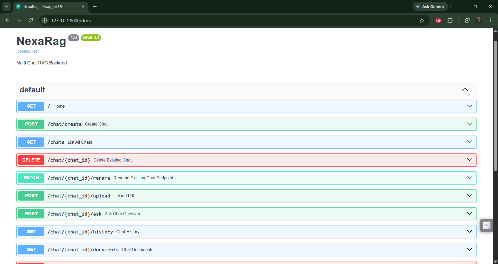

````markdown
# NexaRAG

### Multi-Chat Retrieval-Augmented Generation Knowledge Assistant

NexaRAG is a full-stack knowledge assistant that allows users to create isolated conversations, upload PDF documents, and interact with their documents using Retrieval-Augmented Generation (RAG).

The application combines a Streamlit frontend with a FastAPI backend, LangChain for the RAG pipeline, FAISS for vector search, and Google Gemini for embeddings and response generation.

---

## Screenshots

### Main Interface



### RAG Document Q&A



### Attached Documents



### API Configuration



### FastAPI Swagger API



---
## Features

- Multi-chat conversation management
- Isolated document storage for each chat
- PDF document upload and deletion
- PDF text extraction and chunking
- Gemini-powered embeddings
- FAISS vector database for semantic retrieval
- Retrieval-Augmented Generation using LangChain
- Persistent conversation history
- General AI questions without documents
- User-provided Gemini API key support
- FastAPI backend with documented REST endpoints
- Streamlit-based interactive frontend
- Vector database rebuilding after document deletion

---

## Architecture

```text
                    ┌─────────────────────┐
                    │     Streamlit UI    │
                    │     frontend.py     │
                    └──────────┬──────────┘
                               │ HTTP
                               ▼
                    ┌─────────────────────┐
                    │       FastAPI       │
                    │       main.py       │
                    └──────────┬──────────┘
                               ▼
                    ┌─────────────────────┐
                    │    Chat Service     │
                    │  chat_service.py    │
                    └──────────┬──────────┘
                               ▼
             ┌─────────────────┴─────────────────┐
             ▼                                   ▼
    ┌──────────────────┐                ┌──────────────────┐
    │   Chat Manager   │                │   Vector Store   │
    │ chat_manager.py  │                │ vector_store.py  │
    └──────────────────┘                └────────┬─────────┘
                                                 ▼
                                      ┌──────────────────┐
                                      │       FAISS      │
                                      └────────┬─────────┘
                                               ▼
                                      ┌──────────────────┐
                                      │ LangChain +      │
                                      │ Google Gemini    │
                                      └──────────────────┘
````

---

## How RAG Works

### When a PDF is uploaded

```text
PDF
 │
 ▼
Document Loading
 │
 ▼
Text Chunking
 │
 ▼
Gemini Embeddings
 │
 ▼
FAISS Vector Store
```

### When a user asks a question

```text
User Question
      │
      ▼
Vector Retrieval
      │
      ▼
Relevant Document Chunks
      │
      ▼
LangChain Retrieval Chain
      │
      ▼
Google Gemini
      │
      ▼
Generated Answer
```

If no documents are available, NexaRAG can answer using the configured Gemini model directly.

---

## Project Structure

```text
NexaRag/
│
├── main.py
├── frontend.py
├── requirements.txt
├── .env.example
├── .gitignore
│
├── rag/
│   ├── chains.py
│   ├── chat_manager.py
│   ├── chat_service.py
│   ├── config.py
│   ├── document_loader.py
│   ├── memory.py
│   ├── prompts.py
│   └── vector_store.py
│
├── tests/
│   └── test.py
│
├── chats/
│   └── .gitkeep
│
└── screenshots/
    ├── main-ui.png
    ├── rag-chat.png
    ├── documents.png
    ├── api-settings.png
    └── swagger-api.png
```

---

## Tech Stack

| Technology    | Purpose                    |
| ------------- | -------------------------- |
| Python        | Application development    |
| FastAPI       | Backend REST API           |
| Streamlit     | Frontend UI                |
| LangChain     | RAG pipeline orchestration |
| FAISS         | Vector similarity search   |
| Google Gemini | LLM and embeddings         |
| PyPDF         | PDF processing             |
| Pydantic      | API request validation     |
| Uvicorn       | FastAPI server             |

---

## Running Locally

### 1. Clone the repository

```bash
git clone https://github.com/Thilak231/NexaRAG.git
cd NexaRAG
```

### 2. Create a virtual environment

```bash
python -m venv venv
```

Activate it on Windows:

```bash
venv\Scripts\activate
```

### 3. Install dependencies

```bash
pip install -r requirements.txt
```

### 4. Configure the Gemini API key

Create a `.env` file based on `.env.example`.

```env
GOOGLE_API_KEY=your_gemini_api_key
```

### 5. Start the FastAPI backend

```bash
uvicorn main:app --reload
```

Backend:

```text
http://127.0.0.1:8000
```

Swagger documentation:

```text
http://127.0.0.1:8000/docs
```

### 6. Start the Streamlit frontend

Open another terminal with the virtual environment activated:

```bash
streamlit run frontend.py
```

Frontend:

```text
http://localhost:8501
```

---

## API Endpoints

| Method | Endpoint                               | Description              |
| ------ | -------------------------------------- | ------------------------ |
| GET    | `/`                                    | Backend health check     |
| POST   | `/chat/create`                         | Create a new chat        |
| GET    | `/chats`                               | List all chats           |
| DELETE | `/chat/{chat_id}`                      | Delete a chat            |
| PATCH  | `/chat/{chat_id}/rename`               | Rename a chat            |
| POST   | `/chat/{chat_id}/upload`               | Upload a PDF             |
| POST   | `/chat/{chat_id}/ask`                  | Ask a question           |
| GET    | `/chat/{chat_id}/history`              | Get conversation history |
| GET    | `/chat/{chat_id}/documents`            | List chat documents      |
| DELETE | `/chat/{chat_id}/documents/{filename}` | Delete a document        |

---

## Environment Variables

The repository does not contain API keys.

Create your own `.env` file:

```env
GOOGLE_API_KEY=your_gemini_api_key
```

The `.env` file is excluded from Git using `.gitignore`.

---

## Key Design Decisions

### Chat Isolation

Each conversation maintains its own:

* Conversation history
* Uploaded documents
* FAISS vector index

This prevents documents from one conversation from being retrieved in another conversation.

### Vector Retrieval

Uploaded PDF content is converted into embeddings and stored in a FAISS index. User questions are used to retrieve the most relevant document chunks before generating an answer.

### API Separation

The application separates the frontend from the backend:

```text
Streamlit → FastAPI → RAG Service → FAISS / Gemini
```

This allows the backend API to operate independently of the Streamlit interface.

````

